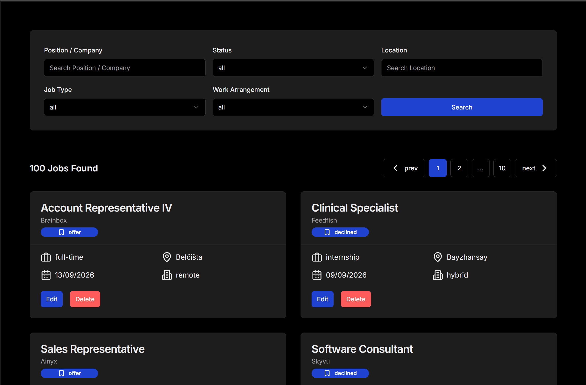
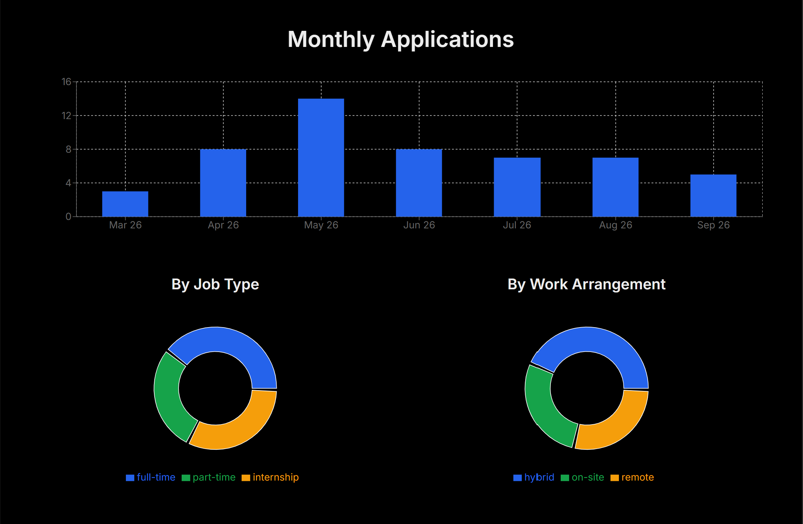

# Job Tracker

**Live site:** https://hk-jobtracker.vercel.app/

Track and manage all your applications in one place. Log the role, company and status as you apply, then search and filter by role, company, status, location, job type and arrangement to find exactly what you need. A built-in stats page turns all that data into clear charts and breakdowns, so you can see exactly how your search is progressing at a glance.

## Screenshots

**All Jobs:** search, filter and page through every application you've logged.

**Stats:** monthly application trends, plus a breakdown by job type and work arrangement.

## Try it out

A demo account is available directly from the landing page (no sign-up required). Click **Try Demo** to be signed in instantly and explore the app with sample data already loaded.

## Features

- Log, edit and delete job applications, including position, company, location, status, job type and work arrangement
- Search by position or company name, and filter by status, location, job type and work arrangement, all combinable at once
- Paginated results for large lists of applications
- A stats dashboard with a breakdown of applications by status, a monthly applications chart, and pie charts for job type and work arrangement
- Authentication handled via Clerk, including a one-click demo login
- Light and dark theme support

## Built with

- [Next.js](https://nextjs.org/)
- [TypeScript](https://www.typescriptlang.org/)
- [Clerk](https://clerk.com/): authentication
- [Prisma](https://www.prisma.io/): ORM
- [TanStack Query](https://tanstack.com/query): data fetching and caching
- [React Hook Form](https://react-hook-form.com/): form state management
- [Zod](https://zod.dev/): schema validation
- [Recharts](https://recharts.org/): charts
- [Tailwind CSS](https://tailwindcss.com/): styling
- [shadcn/ui](https://ui.shadcn.com/): UI components
